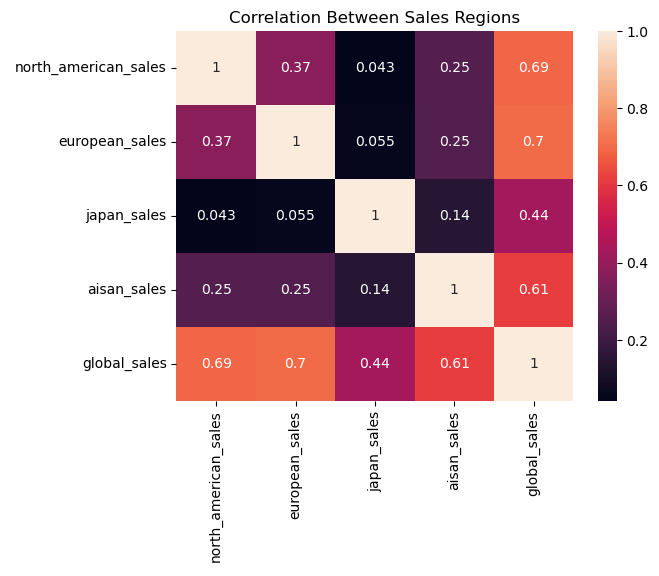
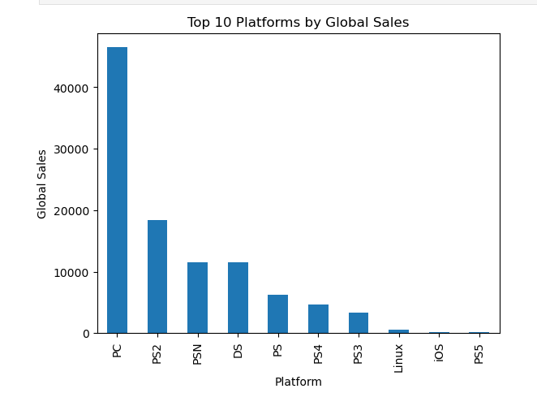

## 📊 Visualizations

### 🎮 Top Selling Games
This chart highlights the highest-selling video games globally based on total sales, showing which titles dominate the market.

---

### 🕹 Sales by Platform
This visualization compares the performance of different gaming platforms, revealing which platforms generate the most global sales.

---

### 💡 Key Insight
From the analysis, certain platforms and titles clearly dominate global sales, while others show lower performance, indicating strong market competition and regional preferences.
