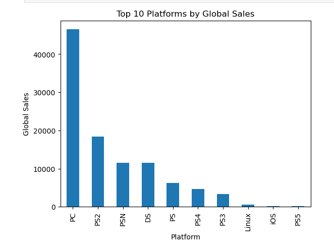
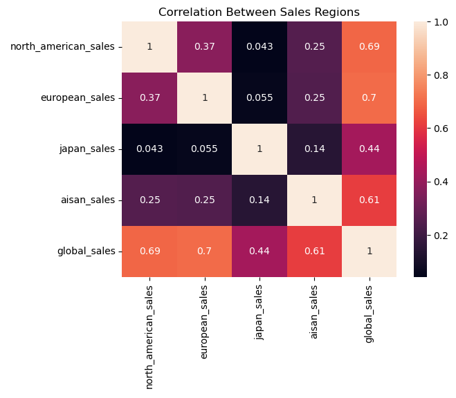

# 🎮 Gaming Market Insights — Video Game Sales Analysis

Exploratory data analysis of global video game sales using **Python**, **Pandas**, **Matplotlib**, and **Seaborn**. The project investigates which platforms, genres, and publishers dominate the market, and how regional sales relate to one another.

## 📌 Project Overview

Using a dataset of video game sales records (title, platform, genre, publisher, critic score, and regional sales figures), this analysis explores:

- The **top-selling video games** globally
- **Sales performance by platform** (PC, PS2, PSN, DS, and others)
- **Sales trends by genre** and by **publisher**
- How **global sales evolved over time**
- The relationship between **critic scores and sales**
- **Correlation between regional sales** (North America, Europe, Japan, Asia, Global)

## 📊 Visualizations

### 🕹️ Sales by Platform
Comparison of platform performance by total global sales — PC and PlayStation platforms clearly lead the market.



### 🔥 Correlation Between Sales Regions
Heatmap showing how sales in each region correlate with one another and with global sales. North America and Europe show the strongest relationship with global sales performance.



> The full notebook (`notebooks/video_game_sales_analysis.ipynb`) contains additional charts not exported as images here, including genre sales, sales by year, top publishers, and a critic-score-vs-sales scatter plot — open it directly to view the complete analysis.

## 💡 Key Insights

- **PC and PlayStation platforms** dominate global sales.
- **Adventure and Shooter** genres generate the highest global sales.
- Higher **critic scores** tend to correlate with higher global sales.
- **North America and Europe** contribute the largest share of global video game sales, while Japan and other Asian markets contribute comparatively less.

## 🗂️ Repository Structure

```
Gaming-Market-Insights/
├── notebooks/
│   └── video_game_sales_analysis.ipynb   # Full analysis notebook
├── images/
│   ├── platform_sales.png                # Top platforms by global sales
│   └── correlation_heatmap.png           # Regional sales correlation
└── README.md
```

## 🛠️ Tools Used

- **Python** (Pandas, Matplotlib, Seaborn)
- **Jupyter Notebook**

## 🚀 How to Run

1. Clone this repository.
2. Install dependencies: `pip install pandas matplotlib seaborn openpyxl`
3. Place the source dataset (an Excel file with columns such as `title`, `platform`, `genre`, `publisher`, `critic_score`, and regional sales columns) in the repository root, named `Video game sales.xlsx`.
4. Open and run `notebooks/video_game_sales_analysis.ipynb` in Jupyter.

> **Note:** The raw dataset file is not included in this repository. Add your own copy locally to reproduce the full analysis — the notebook expects an Excel file named `Video game sales.xlsx` in the project root.

## 📄 License

Shared for educational and portfolio purposes.
